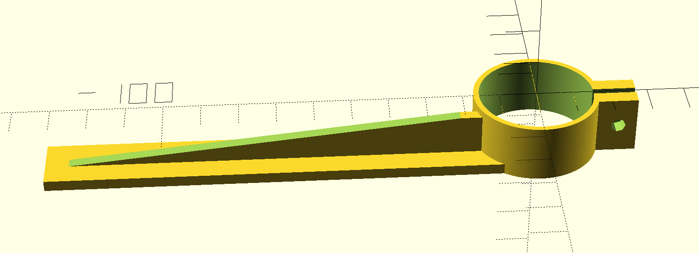

LED module holder
=================

…for behind my monitor.

The idea is to have a [VT-607 6w LED module
](https://www.pollin.de/p/led-einbauleuchte-vt-607-square-eek-a-6-w-420-lm-4500k-eckig-weiss-534801)
mounted at my [Duronic DM251X2 monitor holder
](https://www.amazon.de/gp/product/B018W6LA8E)
pointing upwards for a nice ambiant light while I'm working at my PC.

